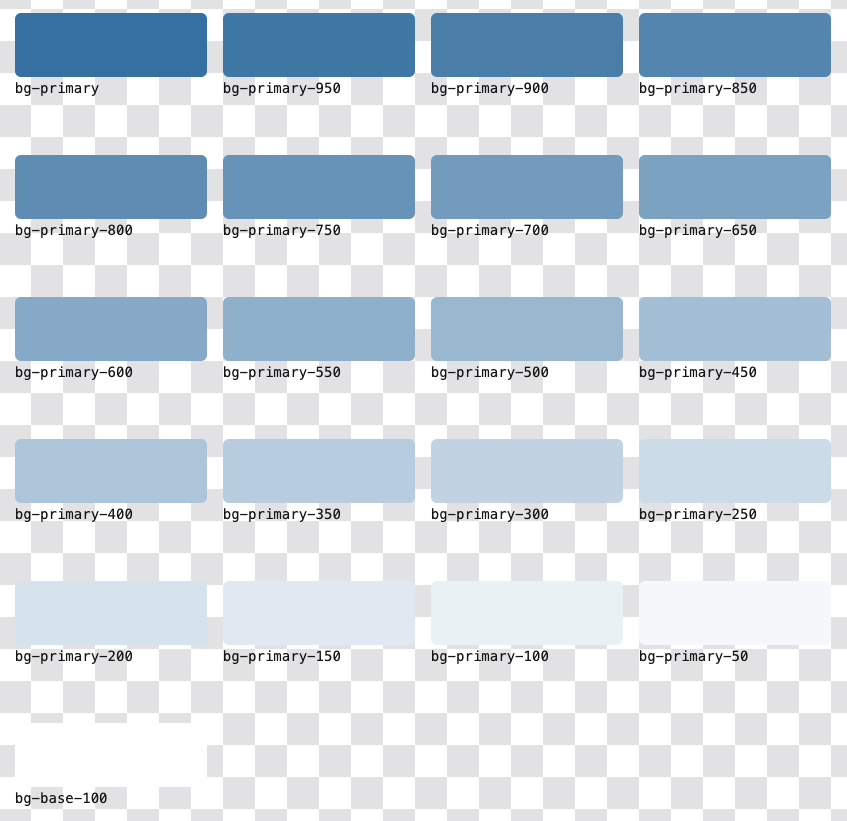
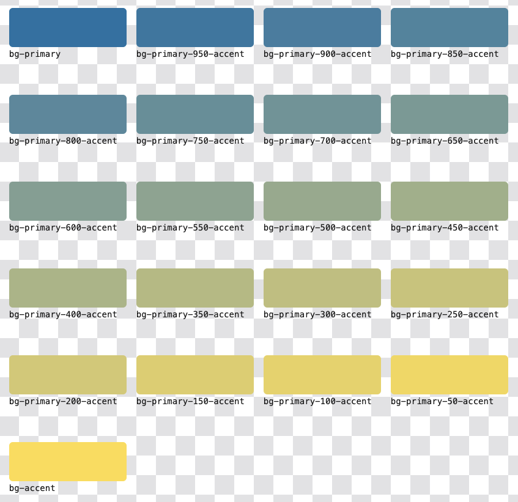

# daisy-ext

`daisy-ext` is a plugin for [`Tailwind`](https://tailwindcss.com/) that ***ext***ends the palette provided by [`DaisyUI`](https://daisyui.com/).
It does this by leveraging [`color-mix`](https://developer.mozilla.org/en-US/docs/Web/CSS/color_value/color-mix) to mix 
the colors provided by DaisyUI themes dynamically in the browser.

## Features

- Tailwind's tree shaking means only the colors used are included in the final app
- Allows for colors to be lightened/darkened without relying on transparency
- Provides the ability to use shades with DaisyUI palette colors: `bg-primary-500`

- Provides the ability to mix DaisyUI palette colors against each other: `bg-primary-300-accent`


## Installation

1. Add `daisy-ext` to your projects `package.json`
```
  "devDependencies": {
    "daisy-ext": "^1.0.0"
  }
```
2. Include `daisy-ext` as a plugin in your `tailwind.config.js`.\
**Make sure you include `daisy-ext` before `daisyui`!**
```js
export default {
  //...
  plugins: [
    require('daisy-ext'),
    require('daisyui')
  ],
}
```

## Project Setup
```sh
npm install
```

### Build library
```sh
npm run build
```

### Lint with [ESLint](https://eslint.org/)
```sh
npm run lint
```

### Format with [Prettier](https://prettier.io/)
```sh
npm run format
```
